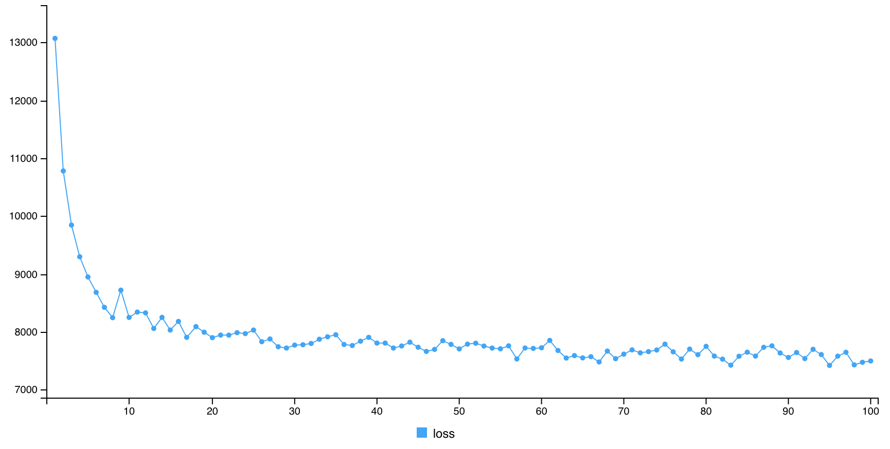
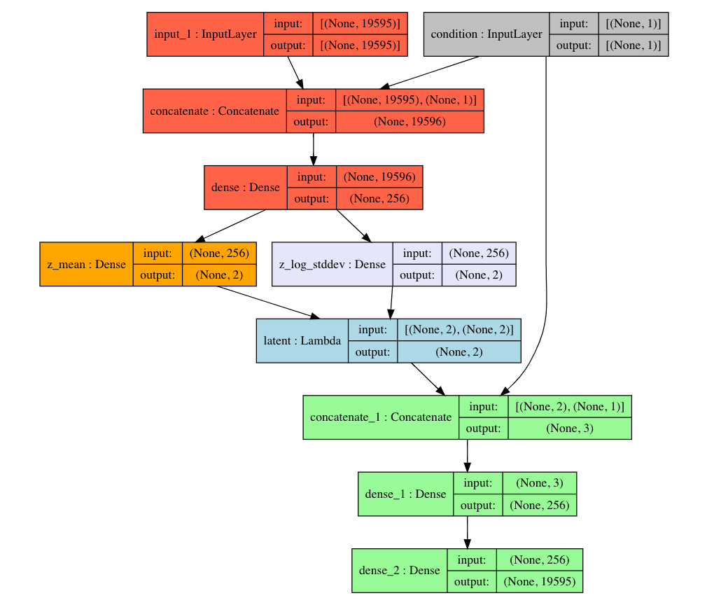
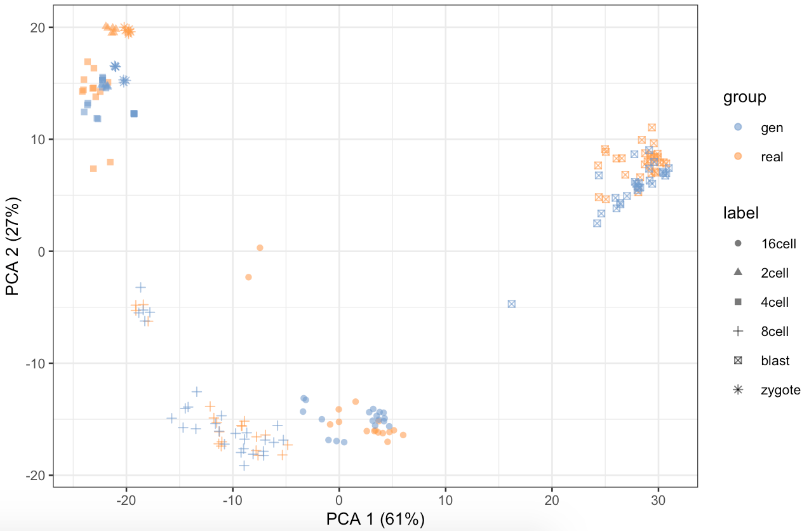

# VAExprs

## Introduction

A fundamental problem in biomedical research is the low number of observations, mostly due to a lack of available biosamples, prohibitive costs, or ethical reasons. By augmenting a few real observations with artificially generated samples, their analysis could lead to more robust and higher reproducible. One possible solution to the problem is the use of generative models, which are statistical models of data that attempt to capture the entire probability distribution from the observations. Using the variational autoencoder (VAE), a well-known deep generative model, this package is aimed to generate samples with gene expression data, especially for single-cell RNA-seq data. Furthermore, the VAE can use conditioning to produce specific cell types or subpopulations. The conditional VAE (CVAE) allows us to create targeted samples rather than completely random ones.


## Installation

Before installing this package, tensorflow and kears must be installed in Python and connected to R (https://tensorflow.rstudio.com, https://keras.rstudio.com).
To install the development version from GitHub:
``` 
devtools::install_github("dongminjung/VAExprs")
```


## Tutorial

The "yan" data set is single-cell RNA sequencing data with 20214 genes and 90 cells from human preimplantation embryos and embryonic stem cells at different passages. The rows in the dataset correspond to genes and columns correspond to cells. The "SingleCellExperiment" class can be used to store and manipulate single-cell genomics data. It extends the "RangedSummarizedExperiment" class and follows similar conventions. The object "sce" can be created by the data "yan" with cell type annotation "ann".

```
library(VAExprs)
library(SC3)

# create a SingleCellExperiment object
sce <- SingleCellExperiment(
    assays = list(counts = as.matrix(yan)),
    colData = ann
)

# define feature names in feature_symbol column
rowData(sce)$feature_symbol <- rownames(sce)
# remove features with duplicated names
sce <- sce[!duplicated(rowData(sce)$feature_symbol), ]
# remove genes that are not expressed in any samples
sce <- sce[which(rowMeans(assay(sce)) > 0),]
dim(assay(sce))
```

The CVAE model can be built by using the function "fit_vae" with gene expression data and the cell annotation from the object "sce". The overall loss function of the VAE is expressed as a weighted sum of the reconstruction loss and the regularization loss. The reconstruction loss is the binary cross-entropy loss between the input and output and the regularization loss is simply the Kullback-Leibler divergence measure.
```
# model parameters
batch_size <- 32
original_dim <- 19595
latent_dim <- 2
intermediate_dim <- 256
epochs <- 200

# model
cvae_result <- fit_vae(object = sce,
                       normalization = TRUE,
                       encoder_layers = list(layer_input(shape = c(original_dim)),
                                             layer_dense(units = intermediate_dim,
                                                         activation = "relu")),
                       decoder_layers = list(layer_dense(units = intermediate_dim,
                                                         activation = "relu"),
                                             layer_dense(units = original_dim,
                                                         activation = "sigmoid")),
                       epochs = epochs, batch_size = batch_size,
                       use_generator = TRUE,
                       callbacks = keras::callback_early_stopping(
                           monitor = "loss",
                           patience = 20,
                           restore_best_weights = TRUE))

Epoch 1/100
3/3 [==============================] - 2s 594ms/step - loss: 13166.3818
Epoch 2/100
3/3 [==============================] - 1s 263ms/step - loss: 10823.6898
Epoch 3/100
3/3 [==============================] - 1s 229ms/step - loss: 9851.2135
Epoch 4/100
3/3 [==============================] - 1s 214ms/step - loss: 9368.2640
Epoch 5/100
3/3 [==============================] - 1s 221ms/step - loss: 9149.4072
Epoch 6/100
3/3 [==============================] - 1s 229ms/step - loss: 8784.5710
Epoch 7/100
3/3 [==============================] - 1s 222ms/step - loss: 8648.3044
Epoch 8/100
3/3 [==============================] - 1s 209ms/step - loss: 8556.3317
Epoch 9/100
3/3 [==============================] - 1s 203ms/step - loss: 8529.6104
Epoch 10/100
3/3 [==============================] - 1s 198ms/step - loss: 8230.9616
Epoch 11/100
3/3 [==============================] - 1s 207ms/step - loss: 8093.2619
Epoch 12/100
3/3 [==============================] - 1s 221ms/step - loss: 8263.3939
Epoch 13/100
3/3 [==============================] - 1s 431ms/step - loss: 8202.0350
Epoch 14/100
3/3 [==============================] - 1s 198ms/step - loss: 8028.9461
Epoch 15/100
3/3 [==============================] - 1s 202ms/step - loss: 8161.2812
Epoch 16/100
3/3 [==============================] - 1s 206ms/step - loss: 8052.1999
Epoch 17/100
3/3 [==============================] - 1s 205ms/step - loss: 7887.9494
Epoch 18/100
3/3 [==============================] - 1s 202ms/step - loss: 8067.0916
Epoch 19/100
3/3 [==============================] - 1s 233ms/step - loss: 7985.5667
Epoch 20/100
3/3 [==============================] - 1s 213ms/step - loss: 7954.0120
Epoch 21/100
3/3 [==============================] - 1s 213ms/step - loss: 8006.4508
Epoch 22/100
3/3 [==============================] - 1s 446ms/step - loss: 7846.0843
Epoch 23/100
3/3 [==============================] - 1s 223ms/step - loss: 7946.9338
Epoch 24/100
3/3 [==============================] - 1s 209ms/step - loss: 7850.0553
Epoch 25/100
3/3 [==============================] - 1s 212ms/step - loss: 7912.3420
Epoch 26/100
3/3 [==============================] - 1s 205ms/step - loss: 7945.1095
Epoch 27/100
3/3 [==============================] - 1s 211ms/step - loss: 7703.9207
Epoch 28/100
3/3 [==============================] - 1s 201ms/step - loss: 7941.4056
Epoch 29/100
3/3 [==============================] - 1s 205ms/step - loss: 7972.3307
Epoch 30/100
3/3 [==============================] - 1s 214ms/step - loss: 7948.8006
Epoch 31/100
3/3 [==============================] - 1s 215ms/step - loss: 7685.3927
Epoch 32/100
3/3 [==============================] - 1s 201ms/step - loss: 7701.1960
Epoch 33/100
3/3 [==============================] - 1s 207ms/step - loss: 7748.8172
Epoch 34/100
3/3 [==============================] - 1s 200ms/step - loss: 7755.4062
Epoch 35/100
3/3 [==============================] - 1s 203ms/step - loss: 7794.0658
Epoch 36/100
3/3 [==============================] - 1s 195ms/step - loss: 7822.2728
Epoch 37/100
3/3 [==============================] - 1s 200ms/step - loss: 7692.1629
Epoch 38/100
3/3 [==============================] - 1s 230ms/step - loss: 7710.9448
Epoch 39/100
3/3 [==============================] - 1s 219ms/step - loss: 7767.7743
Epoch 40/100
3/3 [==============================] - 1s 213ms/step - loss: 7668.8271
Epoch 41/100
3/3 [==============================] - 1s 203ms/step - loss: 7728.0329
Epoch 42/100
3/3 [==============================] - 1s 200ms/step - loss: 7740.6987
Epoch 43/100
3/3 [==============================] - 1s 207ms/step - loss: 7906.1608
Epoch 44/100
3/3 [==============================] - 1s 202ms/step - loss: 7550.3789
Epoch 45/100
3/3 [==============================] - 1s 200ms/step - loss: 7688.6839
Epoch 46/100
3/3 [==============================] - 1s 207ms/step - loss: 7762.8184
Epoch 47/100
3/3 [==============================] - 1s 229ms/step - loss: 7707.0117
Epoch 48/100
3/3 [==============================] - 1s 227ms/step - loss: 7711.2271
Epoch 49/100
3/3 [==============================] - 1s 213ms/step - loss: 7757.5496
Epoch 50/100
3/3 [==============================] - 1s 204ms/step - loss: 7641.7731
Epoch 51/100
3/3 [==============================] - 1s 205ms/step - loss: 7615.9588
Epoch 52/100
3/3 [==============================] - 1s 196ms/step - loss: 7607.2295
Epoch 53/100
3/3 [==============================] - 1s 195ms/step - loss: 7699.8200
Epoch 54/100
3/3 [==============================] - 1s 205ms/step - loss: 7715.3997
Epoch 55/100
3/3 [==============================] - 1s 220ms/step - loss: 7810.0929
Epoch 56/100
3/3 [==============================] - 1s 205ms/step - loss: 7681.5949
Epoch 57/100
3/3 [==============================] - 1s 208ms/step - loss: 7657.8905
Epoch 58/100
3/3 [==============================] - 1s 202ms/step - loss: 7839.3740
Epoch 59/100
3/3 [==============================] - 1s 206ms/step - loss: 7693.8001
Epoch 60/100
3/3 [==============================] - 1s 197ms/step - loss: 7643.2917
Epoch 61/100
3/3 [==============================] - 1s 196ms/step - loss: 7696.5643
Epoch 62/100
3/3 [==============================] - 1s 224ms/step - loss: 7844.9982
Epoch 63/100
3/3 [==============================] - 1s 219ms/step - loss: 7605.6353
Epoch 64/100
3/3 [==============================] - 1s 258ms/step - loss: 7692.2438
```



The function "plot_vae" draws the plot for model architecture.
```
# model architecture
plot_vae(cvae_result$model)
```



The function "gen_exprs" can generate samples with expression data by using the trained model.
```
# sample generation
set.seed(1)
gen_sample_result <- gen_exprs(cvae_result, 100,
                               batch_size, use_generator = TRUE)
```

The function "plot_aug" uses reduced dimension plots for augmented data visualization.
```
# plot for augmented data
plot_aug(gen_sample_result, "PCA")
```

